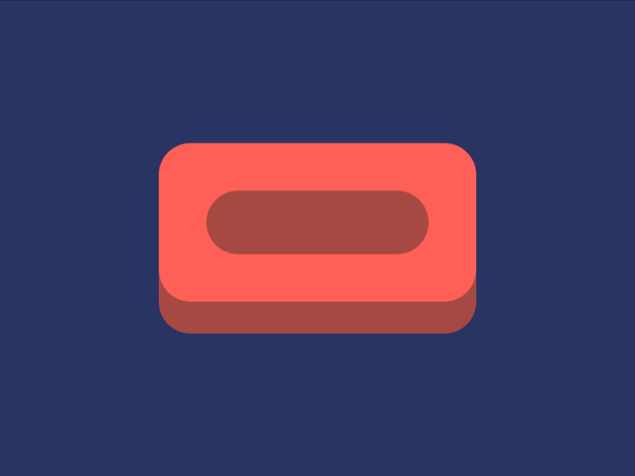

# #48. Wash Your Hands

Challenge: <https://cssbattle.dev/play/48>

## Result

<table>
	<tr>
		<th width="50%">User Submission</th>
		<th width="50%">Target</th>
	</tr>
	<tr>
		<td width="50%" align="center">
			
		</td>
		<td width="50%" align="center">
			
		</td>
	</tr>
</table>

## Code

```html
<style>*{border-radius:20px}&{background:#FE5F55;margin:90 100 110;box-shadow:0 20px#A64942,0 0 0 9in#293462;*{background:#A64942;margin:30
```

## Prettified code

```html
<style>
* {
  border-radius: 20px;
}
& {
  background: #fe5f55;
  margin: 90 100 110;
  box-shadow:
    0 20px #a64942,
    0 0 0 9in #293462;
  * {
    background: #a64942;
    margin: 30;
  }
}

</style>
```
