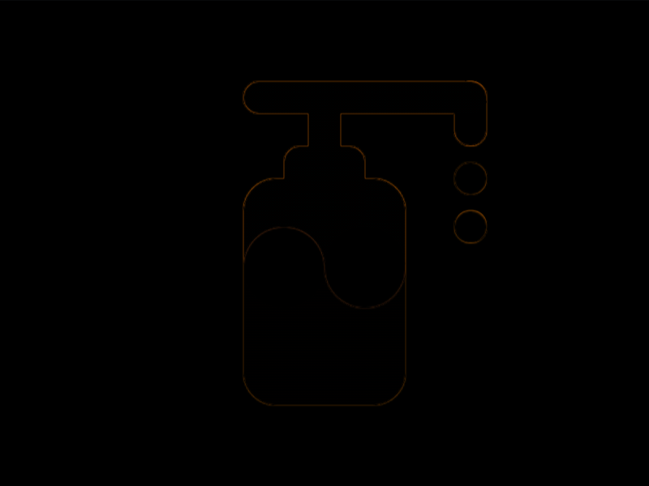
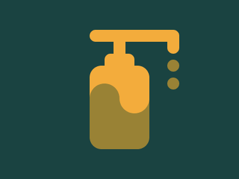

# #50. Use Hand Sanitizer

Challenge: <https://cssbattle.dev/play/50>

## Result

<table>
	<tr>
		<th width="50%">User Submission</th>
		<th width="50%">Target</th>
	</tr>
	<tr>
		<td width="50%" align="center">
			
		</td>
		<td width="50%" align="center">
			
		</td>
	</tr>
</table>

## Code

```html
<s><o><a><p><style>*{background:#1A4341;color:998235}s,o,a,p{position:fixed;--r:10q;padding:var(--p,25);--x:-5%25}o,p{--p:5%10;--x:-55-10;box-shadow:var(--s,95q -11q)#F3AC3C}a{--p:10 75;--x:-30-50}p{--p:10;--x:-10;--s:-50px 111q 0 15px,69q 53q,69q 84q,0 111q 0 15px}*>*{margin:var(--x,110 150 50);border-radius:var(--r,22q);background:linear-gradient(#F3AC3C,55q,#998235 0
```

## Prettified code

```html
<s><o><a><p>
<style>
* {
  background: #1a4341;
  color: 998235;
}
s,
o,
a,
p {
  position: fixed;
  --r: 10Q;
  padding: var(--p, 25);
  --x: -5% 25;
}
o,
p {
  --p: 5% 10;
  --x: -55 -10;
  box-shadow: var(--s, 95Q -11Q) #f3ac3c;
}
a {
  --p: 10 75;
  --x: -30 -50;
}
p {
  --p: 10;
  --x: -10;
  --s: -50px 111Q 0 15px, 69Q 53Q, 69Q 84Q, 0 111Q 0 15px;
}
* > * {
  margin: var(--x, 110 150 50);
  border-radius: var(--r, 22Q);
  background: linear-gradient(#f3ac3c, 55Q, #998235 0);
}
</style>
```
