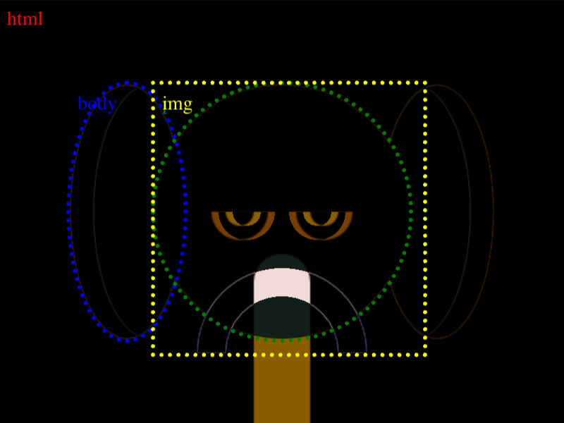

# #71. Elephant

Challenge: <https://cssbattle.dev/play/71>

## Result

<table>
	<tr>
		<th width="50%">User Submission</th>
		<th width="50%">Target</th>
	</tr>
	<tr>
		<td width="50%" align="center">
			
		</td>
		<td width="50%" align="center">
			
		</td>
	</tr>
</table>

## Code

```html
<p>

<style>
&{
  background:#998235;
  body{
    -webkit-box-reflect:right 140px;
   background:#0B2429;
   margin:60 270 60 50;
   box-shadow:inset 17px 0#1A4341;
  
 }
  body,p{
     border-radius:100%;
  }
  p{
    height: 180;
    margin: 0 -160 0 60;
    background:linear-gradient(90deg,#1A4341 90px, #0000 0);
  }
  img{
    padding:95;
    background:
      radial-gradient(1q at 100% 100%, #0000 40px,#FFF 0 60px,#0000 0) -100px,
      radial-gradient(1q at top,#0B2429 10px,#998235 0 20px,#0000) -30px 90px
      ;
  }
 }
```

## Prettified code

```html
<p>

<style>
&{
  background:#998235;
  body{
    -webkit-box-reflect:right 140px;
   background:#0B2429;
   margin:60 270 60 50;
   box-shadow:inset 17px 0#1A4341;
  
 }
  body,p{
     border-radius:100%;
  }
  p{
    height: 180;
    margin: 0 -160 0 60;
    background:linear-gradient(90deg,#1A4341 90px, #0000 0);
  }
  img{
    padding:95;
    background:
      radial-gradient(1q at 100% 100%, #0000 40px,#FFF 0 60px,#0000 0) -100px,
      radial-gradient(1q at top,#0B2429 10px,#998235 0 20px,#0000) -30px 90px
      ;
  }
 }
```
