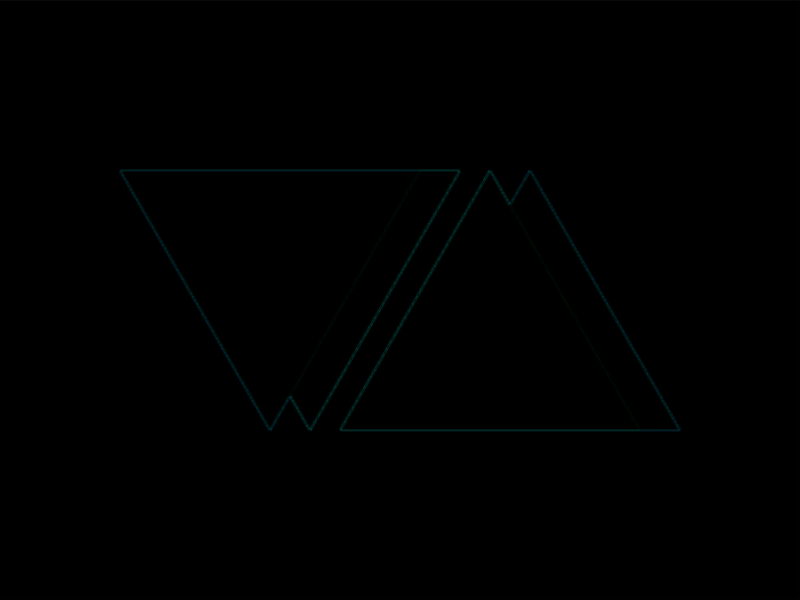

# #14. Web Maker Logo

Challenge: <https://cssbattle.dev/play/14>

## Result

<table>
	<tr>
		<th width="50%">User Submission</th>
		<th width="50%">Target</th>
	</tr>
	<tr>
		<td width="50%" align="center">
			
		</td>
		<td width="50%" align="center">
			
		</td>
	</tr>
</table>

## Code

```html
<p><p><p>
<style>
& {
  background: #f2f2b6;
  * {
    width: 0;
    margin: 85 80;
    border: 75px solid transparent;
    color: FD4602;
    border-top: 138Q solid;
    * {
      color: FF6D00;
      margin: -130 -95;
      + p {
        scale: -1;
        margin: -280 35;
        + p {
          margin: 75 15;
          color: FD4602;
        }
      }
    }
  }
}
</style>
```

## Prettified code

```html
<p><p><p>
<style>
& {
  background: #f2f2b6;
  * {
    width: 0;
    margin: 85 80;
    border: 75px solid transparent;
    color: FD4602;
    border-top: 138Q solid;
    * {
      color: FF6D00;
      margin: -130 -95;
      + p {
        scale: -1;
        margin: -280 35;
        + p {
          margin: 75 15;
          color: FD4602;
        }
      }
    }
  }
}
</style>
```
