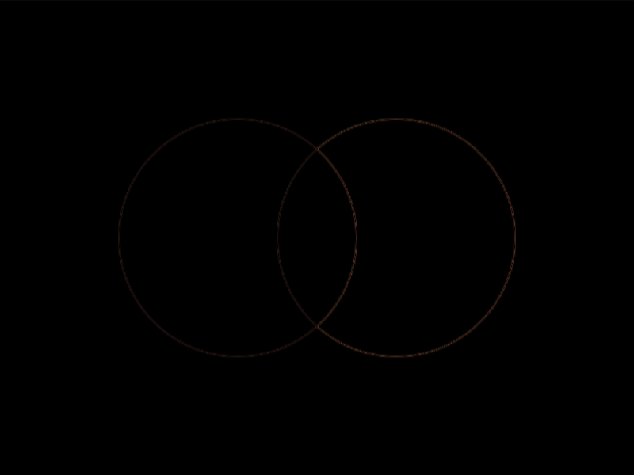

# #15. Overlap

Challenge: <https://cssbattle.dev/play/15>

## Result

<table>
	<tr>
		<th width="50%">User Submission</th>
		<th width="50%">Target</th>
	</tr>
	<tr>
		<td width="50%" align="center">
			
		</td>
		<td width="50%" align="center">
			
		</td>
	</tr>
</table>

## Code

```html
<style>&{border-radius:9in;background:#09042A;margin:75 175 75 75;box-shadow:inset 100px 0#7B3F61,100px 0#E78481
```

## Prettified code

```html
<style>
& {
  border-radius: 9in;
  background: #09042a;
  margin: 75 175 75 75;
  box-shadow:
    inset 100px 0 #7b3f61,
    100px 0 #e78481;
}

</style>
```
