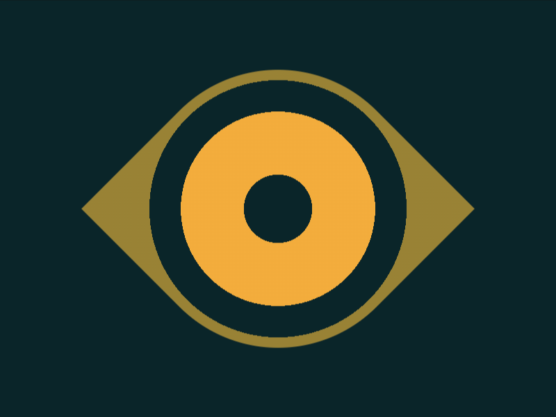

# #16. Eye of the Tiger

Challenge: <https://cssbattle.dev/play/16>

## Result

<table>
	<tr>
		<th width="50%">User Submission</th>
		<th width="50%">Target</th>
	</tr>
	<tr>
		<td width="50%" align="center">
			
		</td>
		<td width="50%" align="center">
			
		</td>
	</tr>
</table>

## Code

```html
<style>&{background:#0b2429;*{margin:50 100;border-radius:50%0;rotate:45deg;background:radial-gradient(#0000 26Q,#f3ac3c 0 74Q,#0000 0 5lh,#998235 0 116Q
```

## Prettified code

```html
<style>
& {
  background: #0b2429;
  * {
    margin: 50 100;
    border-radius: 50% 0;
    rotate: 45deg;
    background: radial-gradient(
      transparent 26Q,
      #f3ac3c 0 74Q,
      transparent 0 5lh,
      #998235 0 116Q
    );
  }
}

</style>
```
