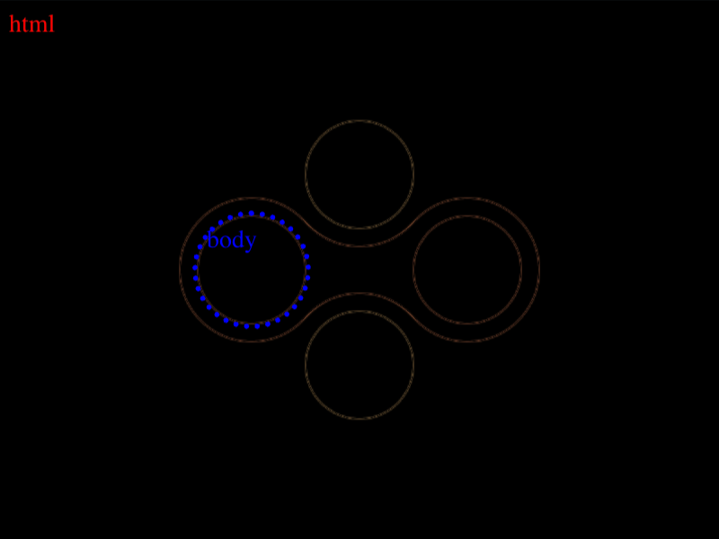

# #17. Fidget Spinner

Challenge: <https://cssbattle.dev/play/17>

## Result

<table>
	<tr>
		<th width="50%">User Submission</th>
		<th width="50%">Target</th>
	</tr>
	<tr>
		<td width="50%" align="center">
			
		</td>
		<td width="50%" align="center">
			
		</td>
	</tr>
</table>

## Code

```html
<style>&{background:#09042A;*{margin:120 230 120 110;border-radius:9in;background:#09042A;color:#09042A;box-shadow:120px 0,60px -53px#F5BB9C,60px 53px#F5BB9C,60px -54px 0 11px,60px 54px 0 11px,0 0 0 10px#E78481,60px 0 0 10px#E78481,120px 0 0 10px#E78481
```

## Prettified code

```html
<style>
& {
  background: #09042a;
  * {
    margin: 120 230 120 110;
    border-radius: 9in;
    background: #09042a;
    color: #09042a;
    box-shadow:
      120px 0,
      60px -53px #f5bb9c,
      60px 53px #f5bb9c,
      60px -54px 0 11px,
      60px 54px 0 11px,
      0 0 0 10px #e78481,
      60px 0 0 10px #e78481,
      120px 0 0 10px #e78481;
  }
}

</style>
```
