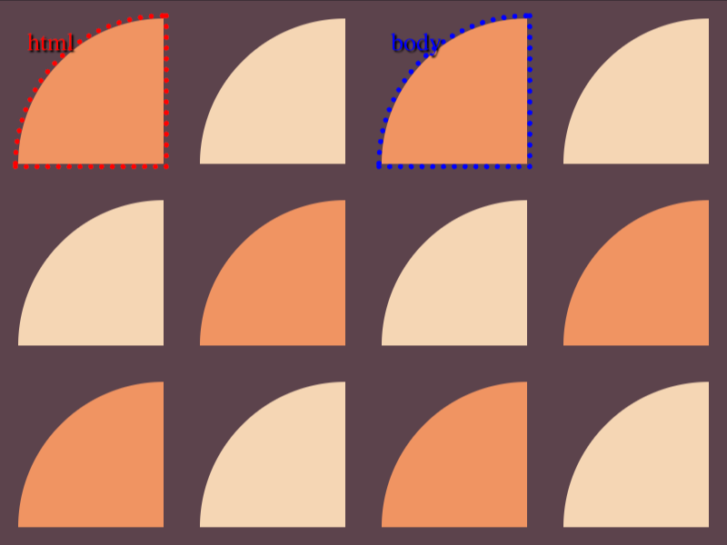

# #18. Matrix

Challenge: <https://cssbattle.dev/play/18>

## Result

<table>
	<tr>
		<th width="50%">User Submission</th>
		<th width="50%">Target</th>
	</tr>
	<tr>
		<td width="50%" align="center">
			
		</td>
		<td width="50%" align="center">
			
		</td>
	</tr>
</table>

## Code

```html
<style>&{background:#5C434C}*{margin:10 310 210 10;border-radius:9in 0 0;color:F09462;box-shadow:inset 1in 0,25vw 0#F5D6B4,0 25vw#F5D6B4,25vw 25vw,0 50vw,25vw 50vw#F5D6B4 var(--b,);*{margin:0-200 0 200
```

## Prettified code

```html
<style>
& {
  background: #5c434c;
}
* {
  margin: 10 310 210 10;
  border-radius: 9in 0 0;
  color: F09462;
  box-shadow:
    inset 1in 0,
    25vw 0 #f5d6b4,
    0 25vw #f5d6b4,
    25vw 25vw,
    0 50vw,
    25vw 50vw #f5d6b4 var(--b,);
  * {
    margin: 0 -200 0 200;
  }
}

</style>
```
