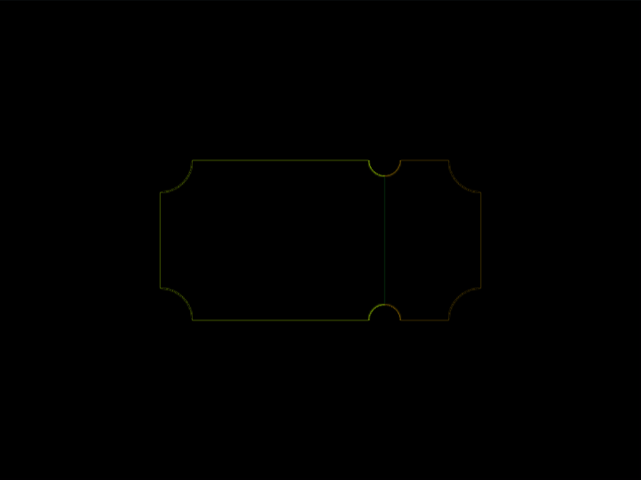

# #20. Ticket

Challenge: <https://cssbattle.dev/play/20>

## Result

<table>
	<tr>
		<th width="50%">User Submission</th>
		<th width="50%">Target</th>
	</tr>
	<tr>
		<td width="50%" align="center">
			
		</td>
		<td width="50%" align="center">
			
		</td>
	</tr>
</table>

## Code

```html
<style>&{background:#62306d;margin:92}img{background:#f7ec7d;padding:53q 70px;border-radius:5vw 10Q 10Q 5vw;corner-shape:scoop;+img{scale:-1;background:#e38f66;padding:50px 30px
```

## Prettified code

```html

<style>
& {
  background: #62306d;
  margin: 92;
}
img {
  background: #f7ec7d;
  padding: 53Q 70px;
  border-radius: 5vw 10Q 10Q 5vw;
  corner-shape: scoop;
  + img {
    scale: -1;
    background: #e38f66;
    padding: 50px 30px;
  }
}
</style>
```
