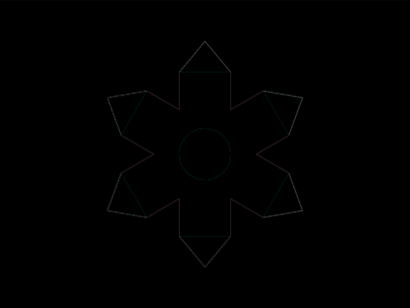
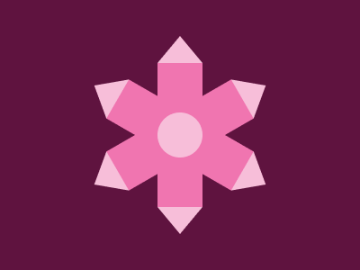

# #197. Crystal

Challenge: <https://cssbattle.dev/play/197>

## Result

<table>
	<tr>
		<th width="50%">User Submission</th>
		<th width="50%">Target</th>
	</tr>
	<tr>
		<td width="50%" align="center">
			
		</td>
		<td width="50%" align="center">
			
		</td>
	</tr>
</table>

## Code

```html
<p><p r=60><p r=120><style>&{background:#5f133f;margin:62 167;color:#f7bed9}p{clip-path:polygon(25px 7q,39vh 39vh,25px 227px,-67px 39vh);height:160;border-block:solid 37px;background:#f075b0;margin:-37 0-234;rotate:attr(r deg)}img{border-top:dotted+53q;translate:0 55px;padding:30
```

## Prettified code

```html
<p><p r=60><p r=120>
<style>
& {
  background: #5f133f;
  margin: 62 167;
  color: #f7bed9;
}
p {
  clip-path: polygon(25px 7Q, 39vh 39vh, 25px 227px, -67px 39vh);
  height: 160;
  border-block: solid 37px;
  background: #f075b0;
  margin: -37 0 -234;
  rotate: attr(r deg);
}
img {
  border-top: dotted +53Q;
  translate: 0 55px;
  padding: 30;
}
</style>
```
