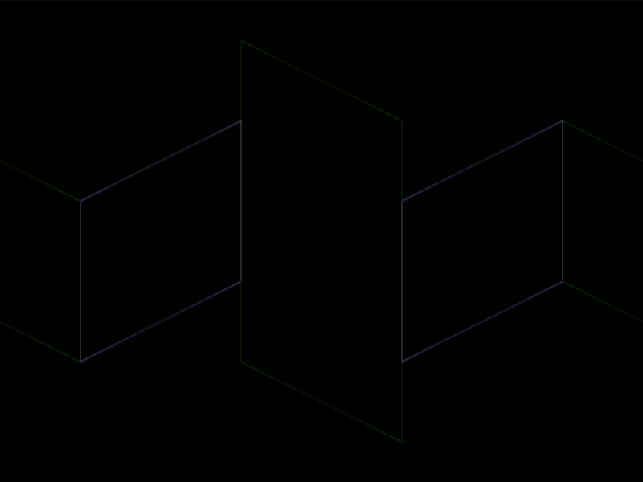
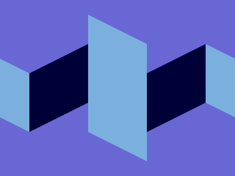

# #198. Walls

Challenge: <https://cssbattle.dev/play/198>

## Result

<table>
	<tr>
		<th width="50%">User Submission</th>
		<th width="50%">Target</th>
	</tr>
	<tr>
		<td width="50%" align="center">
			
		</td>
		<td width="50%" align="center">
			
		</td>
	</tr>
</table>

## Code

```html
<style>&{background:#6867d4;margin:92-58}img{border:solid 53Q;color:7BAFDE;transform:skewy(27deg)}[a]{scale:1-1;color:39}[b]{height:100;margin:-50 0
```

## Prettified code

```html

<style>
& {
  background: #6867d4;
  margin: 92 -58;
}
img {
  border: solid 53Q;
  color: 7BAFDE;
  transform: skewy(27deg);
}
[a] {
  scale: 1 -1;
  color: 39;
}
[b] {
  height: 100;
  margin: -50 0;
}
</style>
```
