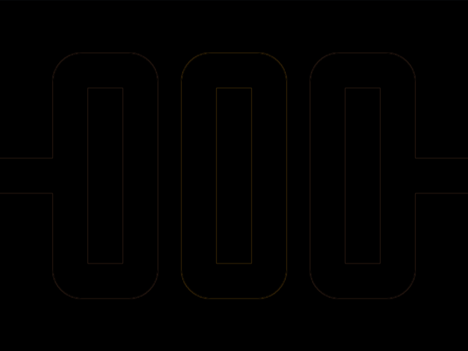
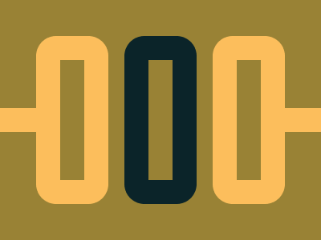

# #201. Triple Zero

Challenge: <https://cssbattle.dev/play/201>

## Result

<table>
	<tr>
		<th width="50%">User Submission</th>
		<th width="50%">Target</th>
	</tr>
	<tr>
		<td width="50%" align="center">
			
		</td>
		<td width="50%" align="center">
			
		</td>
	</tr>
</table>

## Code

```html
<h5><style>&{background:#998235;color:fcbe5c;margin:37 27;*>*{border:solid}[b]{color:#0B2429}}img{padding:75 15;border-width:30;border-radius:27q;margin:0 10}h5{border-width:15;margin:-120 320 0-35;box-shadow:355px 0
```

## Prettified code

```html
<h5>
<style>
& {
  background: #998235;
  color: fcbe5c;
  margin: 37 27;
  * > * {
    border: solid;
  }
  [b] {
    color: #0b2429;
  }
}
img {
  padding: 75 15;
  border-width: 30;
  border-radius: 27Q;
  margin: 0 10;
}
h5 {
  border-width: 15;
  margin: -120 320 0 -35;
  box-shadow: 355px 0;
}
</style>
```
