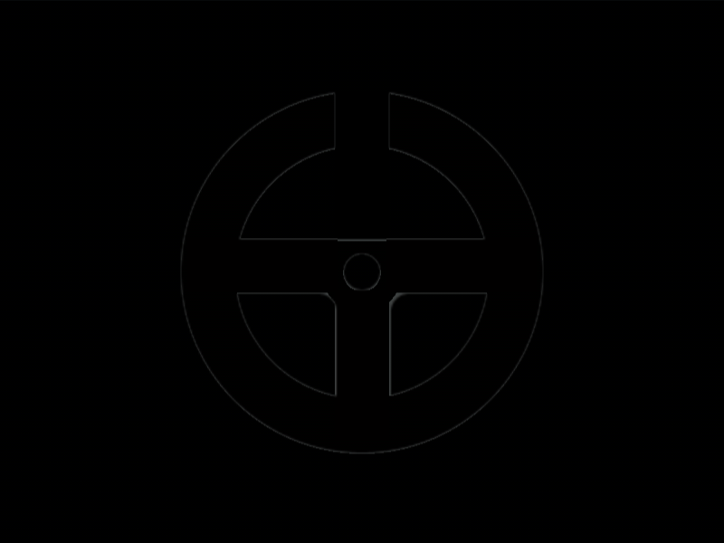

# #202. Steering Wheel

Challenge: <https://cssbattle.dev/play/202>

## Result

<table>
	<tr>
		<th width="50%">User Submission</th>
		<th width="50%">Target</th>
	</tr>
	<tr>
		<td width="50%" align="center">
			
		</td>
		<td width="50%" align="center">
			
		</td>
	</tr>
</table>

## Code

```html
<p><style>&{background:radial-gradient(1Q,#4f77ff 11q,#1038bf 0 22px,#4f77ff 22px 74Q,#1038bf 0 25vw,#4f77ff);*{background:#4F77FF;margin:50 185 168;height:83;box-shadow:0 110px;color:#1038BF;*{background:#1038BF;margin:0;rotate:90deg;translate:55px 55px
```

## Prettified code

```html
<p>
<style>
& {
  background: radial-gradient(
    1Q,
    #4f77ff 11Q,
    #1038bf 0 22px,
    #4f77ff 22px 74Q,
    #1038bf 0 25vw,
    #4f77ff
  );
  * {
    background: #4f77ff;
    margin: 50 185 168;
    height: 83;
    box-shadow: 0 110px;
    color: #1038bf;
    * {
      background: #1038bf;
      margin: 0;
      rotate: 90deg;
      translate: 55px 55px;
    }
  }
}
</style>
```
