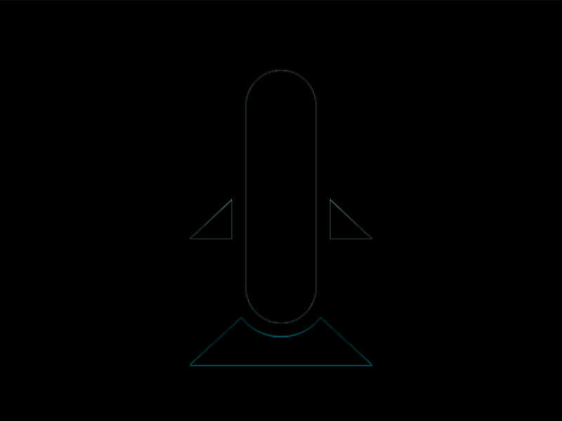

# #222. Rocket

Challenge: <https://cssbattle.dev/play/222>

## Result

<table>
	<tr>
		<th width="50%">User Submission</th>
		<th width="50%">Target</th>
	</tr>
	<tr>
		<td width="50%" align="center">
			
		</td>
		<td width="50%" align="center">
			
		</td>
	</tr>
</table>

## Code

```html
<style>&{color:B0E1FB;margin:129 135;corner-shape:bevel;box-shadow:0 101q#c15965,0 0 0 9in;scale:1 .95;*{--r:9in;margin:-94 30-73;border:11q solid}}*{background:#4b4d88;border-radius:var(--r,1in 1in 0 0
```

## Prettified code

```html
<style>
& {
  color: B0E1FB;
  margin: 129 135;
  corner-shape: bevel;
  box-shadow:
    0 101Q #c15965,
    0 0 0 9in;
  scale: 1 0.95;
  * {
    --r: 9in;
    margin: -94 30 -73;
    border: 11Q solid;
  }
}
* {
  background: #4b4d88;
  border-radius: var(--r, 1in 1in 0 0);
}

</style>
```
