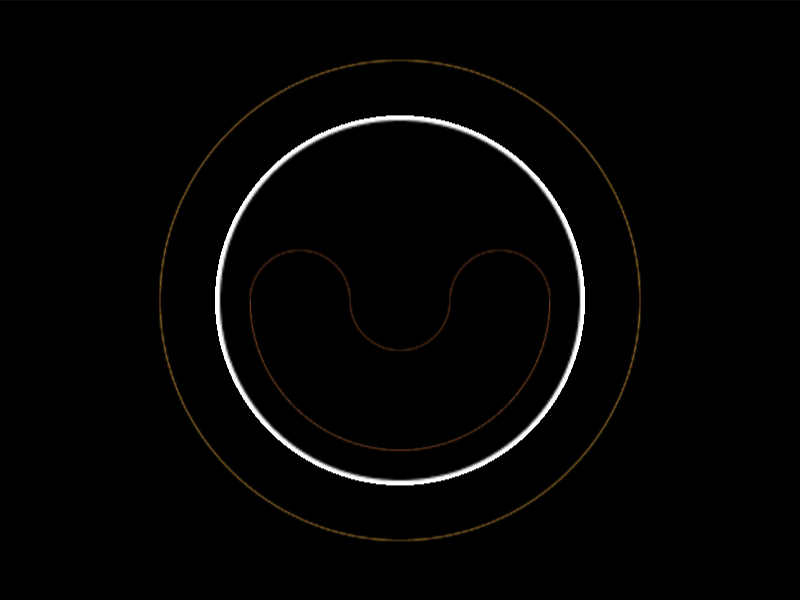

# #224. Levelled

Challenge: <https://cssbattle.dev/play/224>

## Result

<table>
	<tr>
		<th width="50%">User Submission</th>
		<th width="50%">Target</th>
	</tr>
	<tr>
		<td width="50%" align="center">
			
		</td>
		<td width="50%" align="center">
			
		</td>
	</tr>
</table>

## Code

```html
<style>&{--g:radial-gradient(1q at bottom,#67aed4 25px,#0000);background:var(--g)-50px 50vh,var(--g)50px 50vh,radial-gradient(1q at top,#fff 25px,#67aed4 0 79q,#0000)0 50vh,radial-gradient(1q,#fff 0 5lh,#000 0 30vw,#f8b140
```

## Prettified code

```html
<style>
& {
  --g: radial-gradient(1Q at bottom, #67aed4 25px, transparent);
  background:
    var(--g) -50px 50vh,
    var(--g) 50px 50vh,
    radial-gradient(1Q at top, #fff 25px, #67aed4 0 79Q, transparent) 0 50vh,
    radial-gradient(1Q, #fff 0 5lh, #000 0 30vw, #f8b140);
}

</style>
```
