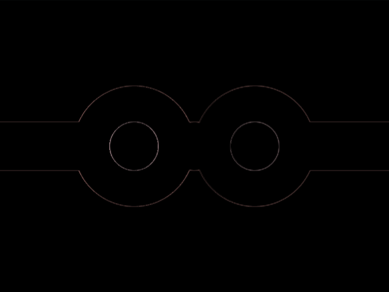

# #226. Bond

Challenge: <https://cssbattle.dev/play/226>

## Result

<table>
	<tr>
		<th width="50%">User Submission</th>
		<th width="50%">Target</th>
	</tr>
	<tr>
		<td width="50%" align="center">
			
		</td>
		<td width="50%" align="center">
			
		</td>
	</tr>
</table>

## Code

```html
<style>&{background:linear-gradient(#FFF 50px,#558C90 0)0 125px;*{margin:0 75;background:radial-gradient(1q,#325853 25px,#fff 0 62px,#0000)0/132q
```

## Prettified code

```html
<style>
& {
  background: linear-gradient(#fff 50px, #558c90 0) 0 125px;
  * {
    margin: 0 75;
    background: radial-gradient(1Q, #325853 25px, #fff 0 62px, transparent) 0 /
      132Q;
  }
}

</style>
```
