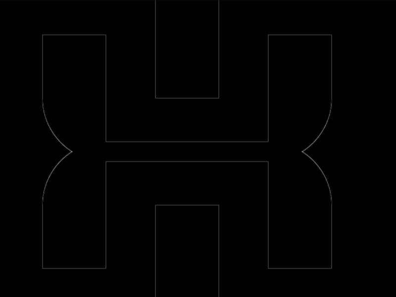

# #246. Limbs

Challenge: <https://cssbattle.dev/play/246>

## Result

<table>
	<tr>
		<th width="50%">User Submission</th>
		<th width="50%">Target</th>
	</tr>
	<tr>
		<td width="50%" align="center">
			
		</td>
		<td width="50%" align="center">
			
		</td>
	</tr>
</table>

## Code

```html
<style>&{background:#333;&>*{margin:35 65 35%43;border-radius:0 0 62q 62q;-webkit-box-reflect:below -15q}*{background:#EEE;*{padding:50 32;translate:38vh -9vw;box-shadow:0-6px 0 53q#333
```

## Prettified code

```html

<style>
& {
  background: #333;
  & > * {
    margin: 35 65 35% 43;
    border-radius: 0 0 62Q 62Q;
    -webkit-box-reflect: below -15Q;
  }
  * {
    background: #eee;
    * {
      padding: 50 32;
      translate: 38vh -9vw;
      box-shadow: 0 -6px 0 53Q #333;
    }
  }
}
</style>
```
