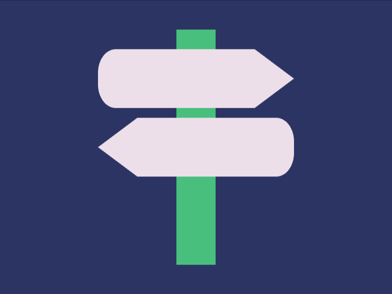

# #261. Road Sign

Challenge: <https://cssbattle.dev/play/261>

## Result

<table>
	<tr>
		<th width="50%">User Submission</th>
		<th width="50%">Target</th>
	</tr>
	<tr>
		<td width="50%" align="center">
			
		</td>
		<td width="50%" align="center">
			
		</td>
	</tr>
</table>

## Code

```html
<p><p><style>&{background:#2d3464}img{background:#48bf7d;padding:120 20;margin:22 172}p{background:#ecdfea;border-radius:32q 67px 67px 32q/5ch 53q 53q 5ch;corner-shape:round bevel bevel round;height:60;width:200;margin:-242 92;scale:1;+p{scale:-1;margin:252 92
```

## Prettified code

```html
<p><p>
<style>
& {
  background: #2d3464;
}
img {
  background: #48bf7d;
  padding: 120 20;
  margin: 22 172;
}
p {
  background: #ecdfea;
  border-radius: 32Q 67px 67px 32Q / 5ch 53Q 53Q 5ch;
  corner-shape: round bevel bevel round;
  height: 60;
  width: 200;
  margin: -242 92;
  scale: 1;
  + p {
    scale: -1;
    margin: 252 92;
  }
}
</style>
```
