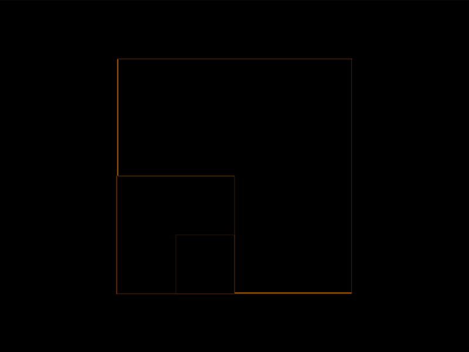

# #23. Boxception

Challenge: <https://cssbattle.dev/play/23>

## Result

<table>
	<tr>
		<th width="50%">User Submission</th>
		<th width="50%">Target</th>
	</tr>
	<tr>
		<td width="50%" align="center">
			
		</td>
		<td width="50%" align="center">
			
		</td>
	</tr>
</table>

## Code

```html
<body bgcolor=f3ac3c style="margin:50% 50% 50 150;box-shadow:-27Q -25px 0 27q #998235,27Q -80Q 0 79Q #1a4341">
```

## Prettified code

```html
<body bgcolor=f3ac3c style="margin:50% 50% 50 150;box-shadow:-27Q -25px 0 27q #998235,27Q -80Q 0 79Q #1a4341">
```
