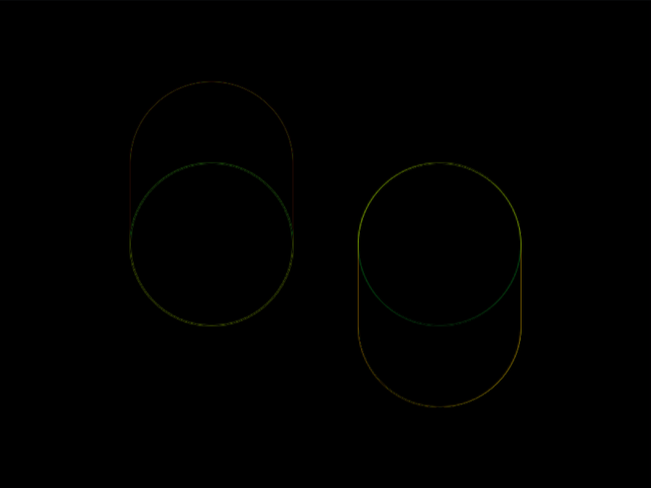
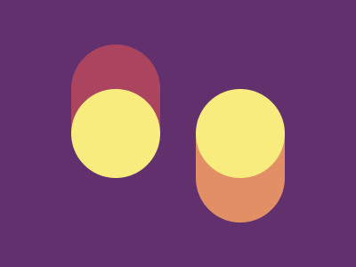

# #24. Switches

Challenge: <https://cssbattle.dev/play/24>

## Result

<table>
	<tr>
		<th width="50%">User Submission</th>
		<th width="50%">Target</th>
	</tr>
	<tr>
		<td width="50%" align="center">
			
		</td>
		<td width="50%" align="center">
			
		</td>
	</tr>
</table>

## Code

```html
<p><style>&{background:#62306D;*{border-radius:9in;height:150;width:100;margin:50 80;color:AA445F;box-shadow:inset 0 53q,inset 2in 0#F7EC7D;*{scale:1-1;color:E38F66;translate:64q 53q
```

## Prettified code

```html
<p>
<style>
& {
  background: #62306d;
  * {
    border-radius: 9in;
    height: 150;
    width: 100;
    margin: 50 80;
    color: AA445F;
    box-shadow:
      inset 0 53Q,
      inset 2in 0 #f7ec7d;
    * {
      scale: 1 -1;
      color: E38F66;
      translate: 64Q 53Q;
    }
  }
}
</style>
```
