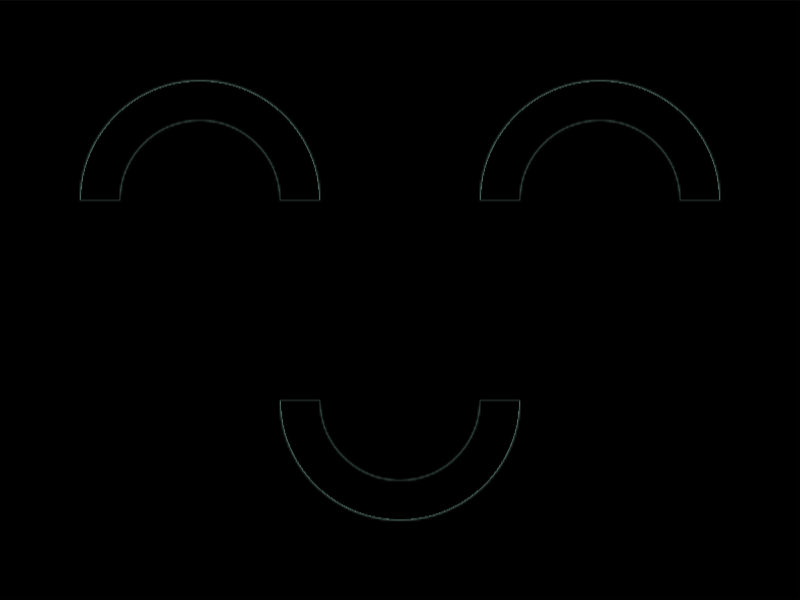

# #26. Smiley

Challenge: <https://cssbattle.dev/play/26>

## Result

<table>
	<tr>
		<th width="50%">User Submission</th>
		<th width="50%">Target</th>
	</tr>
	<tr>
		<td width="50%" align="center">
			
		</td>
		<td width="50%" align="center">
			
		</td>
	</tr>
</table>

## Code

```html
<style>*{background:radial-gradient(1q at bottom,#0000 5ch,#060F55 0 63q,#0000)0-50vw/50vw var(--b,#6592cf);*{--b:;scale:-1;margin:0 100
```

## Prettified code

```html
<style>
* {
  background: radial-gradient(
      1Q at bottom,
      transparent 5ch,
      #060f55 0 63Q,
      transparent
    )
    0 -50vw / 50vw var(--b, #6592cf);
  * {
    --b:;
    scale: -1;
    margin: 0 100;
  }
}

</style>
```
