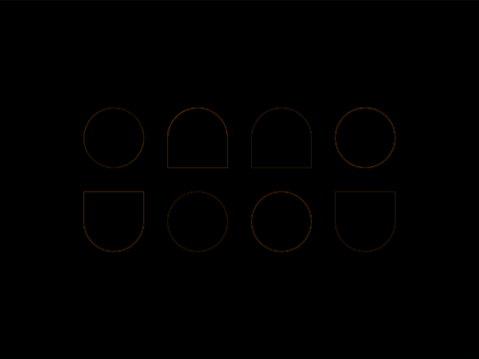

# #28. Cups & Balls

Challenge: <https://cssbattle.dev/play/28>

## Result

<table>
	<tr>
		<th width="50%">User Submission</th>
		<th width="50%">Target</th>
	</tr>
	<tr>
		<td width="50%" align="center">
			
		</td>
		<td width="50%" align="center">
			
		</td>
	</tr>
</table>

## Code

```html
<style>&{background:#1a4341;img{padding:25;border-radius:var(--r,9in);color:998235;box-shadow:var(--s,66Q 87Q,68vw 87Q#f3ac3c,33vw 38vw,214Q 38vw#f3ac3c);+*{--r:9in 9in 0 0;--s:87Q 87Q#f3ac3c,38vw 87Q;+*{scale:-1;--s:-43vw -38vw,1cm -38vw#f3ac3c
```

## Prettified code

```html

<style>
& {
  background: #1a4341;
  img {
    padding: 25;
    border-radius: var(--r, 9in);
    color: 998235;
    box-shadow: var(
      --s,
      66Q 87Q,
      68vw 87Q #f3ac3c,
      33vw 38vw,
      214Q 38vw #f3ac3c
    );
    + * {
      --r: 9in 9in 0 0;
      --s: 87Q 87Q #f3ac3c, 38vw 87Q;
      + * {
        scale: -1;
        --s: -43vw -38vw, 1cm -38vw #f3ac3c;
      }
    }
  }
}
</style>
```
