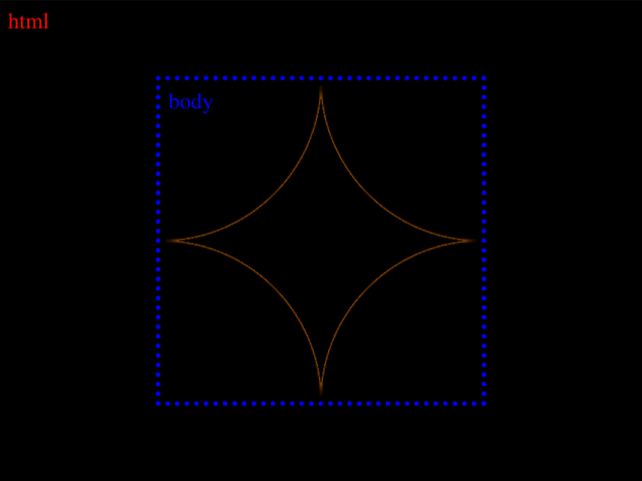

# #29. Suffocate

Challenge: <https://cssbattle.dev/play/29>

## Result

<table>
	<tr>
		<th width="50%">User Submission</th>
		<th width="50%">Target</th>
	</tr>
	<tr>
		<td width="50%" align="center">
			
		</td>
		<td width="50%" align="center">
			
		</td>
	</tr>
</table>

## Code

```html
<style>
& {
  background:#F3AC3C;
  *{
  margin:50 100;
  background:radial-gradient(#F3AC3C 71%, #1A4341 0) 25vw 25vw;
  }
}
</style>
```

## Prettified code

```html
<style>
& {
  background:#F3AC3C;
  *{
  margin:50 100;
  background:radial-gradient(#F3AC3C 71%, #1A4341 0) 25vw 25vw;
  }
}
</style>
```
