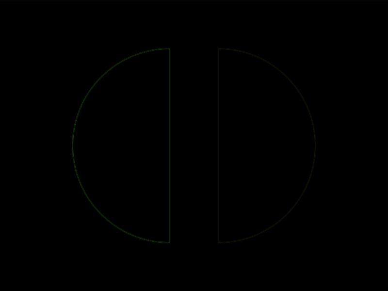

# #31. Equals

Challenge: <https://cssbattle.dev/play/31>

## Result

<table>
	<tr>
		<th width="50%">User Submission</th>
		<th width="50%">Target</th>
	</tr>
	<tr>
		<td width="50%" align="center">
			
		</td>
		<td width="50%" align="center">
			
		</td>
	</tr>
</table>

## Code

```html
<style>*{background:#AA445F;*{margin:50 75;border-radius:9in;background:linear-gradient(90deg,#F7EC7D 106q,#0000 0 158q,#E38F66 0
```

## Prettified code

```html
<style>
* {
  background: #aa445f;
  * {
    margin: 50 75;
    border-radius: 9in;
    background: linear-gradient(
      90deg,
      #f7ec7d 106Q,
      transparent 0 158Q,
      #e38f66 0
    );
  }
}

</style>
```
