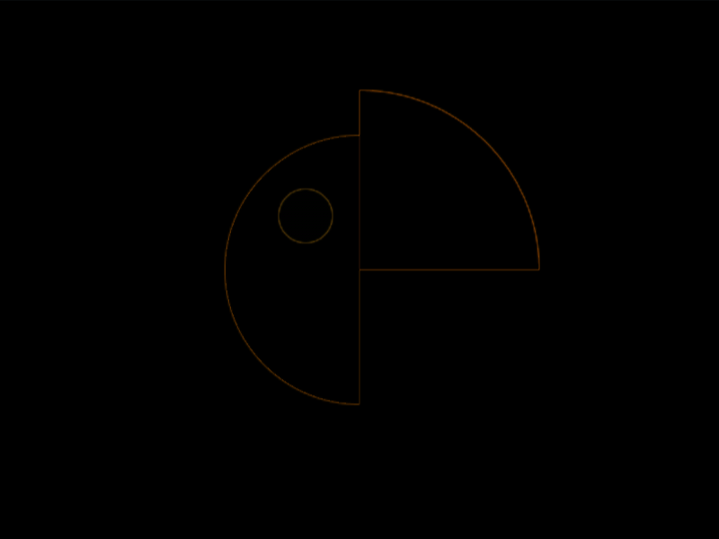

# #33. Birdie

Challenge: <https://cssbattle.dev/play/33>

## Result

<table>
	<tr>
		<th width="50%">User Submission</th>
		<th width="50%">Target</th>
	</tr>
	<tr>
		<td width="50%" align="center">
			
		</td>
		<td width="50%" align="center">
			
		</td>
	</tr>
</table>

## Code

```html
<style>&{background:radial-gradient(1q at 180q 30vw,#0B2429 5vh,#0000),radial-gradient(1q at 100%,#998235 79q,#0000)-50vw,radial-gradient(1q at 0 100%,#F3AC3C 25vw,#1A4341)50vw 50vh
```

## Prettified code

```html
<style>
& {
  background:
    radial-gradient(1Q at 180Q 30vw, #0b2429 5vh, transparent),
    radial-gradient(1Q at 100%, #998235 79Q, transparent) -50vw,
    radial-gradient(1Q at 0 100%, #f3ac3c 25vw, #1a4341) 50vw 50vh;
}

</style>
```
