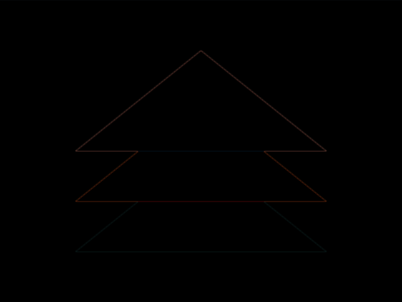

# #34. Christmas Tree

Challenge: <https://cssbattle.dev/play/34>

## Result

<table>
	<tr>
		<th width="50%">User Submission</th>
		<th width="50%">Target</th>
	</tr>
	<tr>
		<td width="50%" align="center">
			
		</td>
		<td width="50%" align="center">
			
		</td>
	</tr>
</table>

## Code

```html
<p><p><p>
<style>
& {
  background: #007065;
  p{
    background:#00A79D;
    height:100;
    margin:150 67 -300;
    clip-path:polygon(50%0,100% 100%,0 100%);
    +p{
      background:#F5C181;
    +p{
      background:#FFEECF;
    }
  }
}
</style>
```

## Prettified code

```html
<p><p><p>
<style>
& {
  background: #007065;
  p{
    background:#00A79D;
    height:100;
    margin:150 67 -300;
    clip-path:polygon(50%0,100% 100%,0 100%);
    +p{
      background:#F5C181;
    +p{
      background:#FFEECF;
    }
  }
}
</style>
```
