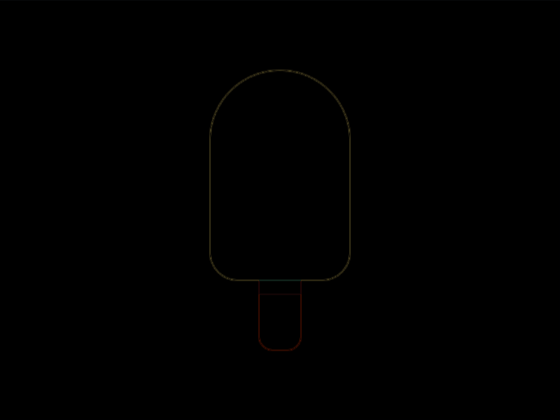

# #35. Ice Cream

Challenge: <https://cssbattle.dev/play/35>

## Result

<table>
	<tr>
		<th width="50%">User Submission</th>
		<th width="50%">Target</th>
	</tr>
	<tr>
		<td width="50%" align="center">
			
		</td>
		<td width="50%" align="center">
			
		</td>
	</tr>
</table>

## Code

```html
<p><style>&{background:#293462;*{background:#FFF1C1;margin:50 150 100;border-radius:50px 50px 5vw 5vw;*{margin:0 35;height:40;border-top:10px solid#A64942;border-radius:0 0 10px 10px;background:#FE5F55;translate:0 50vh
```

## Prettified code

```html
<p>
<style>
& {
  background: #293462;
  * {
    background: #fff1c1;
    margin: 50 150 100;
    border-radius: 50px 50px 5vw 5vw;
    * {
      margin: 0 35;
      height: 40;
      border-top: 10px solid #a64942;
      border-radius: 0 0 10px 10px;
      background: #fe5f55;
      translate: 0 50vh;
    }
  }
}
</style>
```
