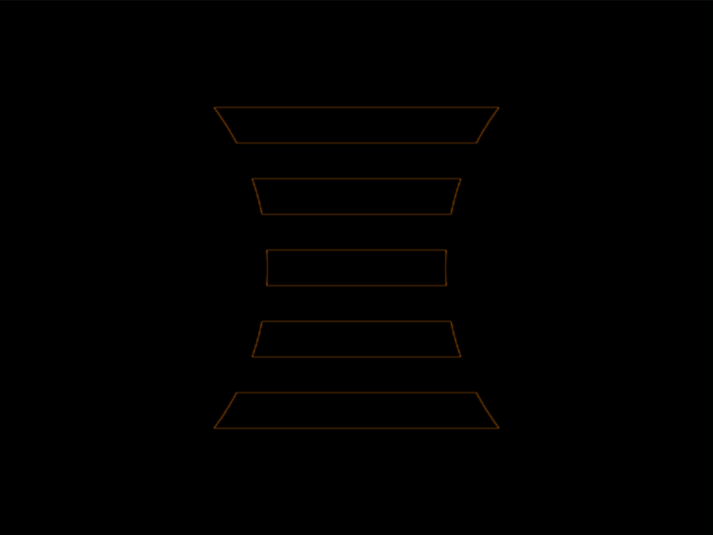

# #44. Stripes

Challenge: <https://cssbattle.dev/battle/8>

## Result

<table>
	<tr>
		<th width="50%">User Submission</th>
		<th width="50%">Target</th>
	</tr>
	<tr>
		<td width="50%" align="center">
			
		</td>
		<td width="50%" align="center">
			
		</td>
	</tr>
</table>

## Code

```html
<style>&{background:radial-gradient(1Q,#1a4341 50vh,#0000)50vw,repeating-linear-gradient(#f3ac3c,21Q,#0000 0 5ch)0/50%60%space#1a4341
```

## Prettified code

```html
<style>
& {
  background:
    radial-gradient(1Q, #1a4341 50vh, transparent) 50vw,
    repeating-linear-gradient(#f3ac3c, 21Q, transparent 0 5ch) 0 / 50% 60% space
      #1a4341;
}

</style>
```
