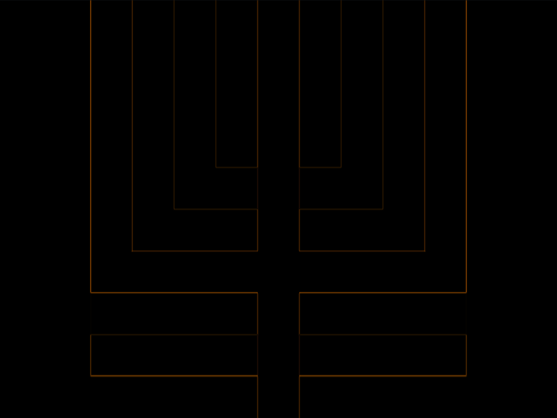

# #45. Magical Tree

Challenge: <https://cssbattle.dev/play/45>

## Result

<table>
	<tr>
		<th width="50%">User Submission</th>
		<th width="50%">Target</th>
	</tr>
	<tr>
		<td width="50%" align="center">
			
		</td>
		<td width="50%" align="center">
			
		</td>
	</tr>
</table>

## Code

```html
<style>&{color:998235;margin:-30 125 150;border:32q solid;background:#1A4341;box-shadow:0 0 0 32q#1A4341,0 0 0 63q#F3AC3C,0 32q 0 63q#1A4341,0 63q 0 63q;*{margin:0 30-200;background:#F3AC3C
```

## Prettified code

```html
<style>
& {
  color: 998235;
  margin: -30 125 150;
  border: 32Q solid;
  background: #1a4341;
  box-shadow:
    0 0 0 32Q #1a4341,
    0 0 0 63Q #f3ac3c,
    0 32Q 0 63Q #1a4341,
    0 63Q 0 63Q;
  * {
    margin: 0 30 -200;
    background: #f3ac3c;
  }
}

</style>
```
