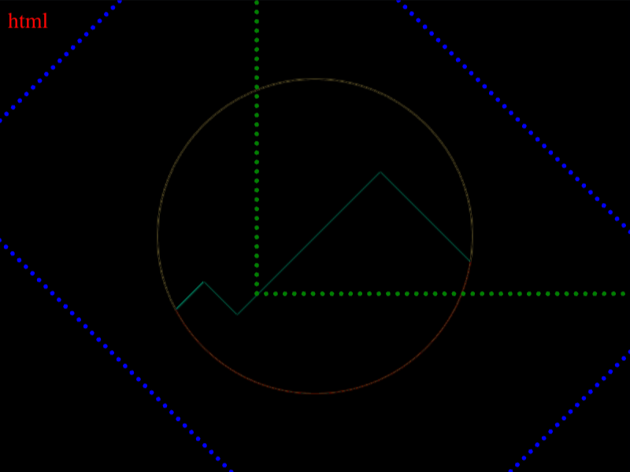

# #46. Mountains

Challenge: <https://cssbattle.dev/play/46>

## Result

<table>
	<tr>
		<th width="50%">User Submission</th>
		<th width="50%">Target</th>
	</tr>
	<tr>
		<td width="50%" align="center">
			
		</td>
		<td width="50%" align="center">
			
		</td>
	</tr>
</table>

## Code

```html
<p><style>&{background:#293462;>*{clip-path:circle(25vw);rotate:45deg;*{color:FE5F55;box-shadow:53vw 278q 0 53q,68vw 41vw 0 5pc,0 0 0 9in#FFF1C1
```

## Prettified code

```html
<p>
<style>
& {
  background: #293462;
  > * {
    clip-path: circle(25vw);
    rotate: 45deg;
    * {
      color: FE5F55;
      box-shadow:
        53vw 278Q 0 53Q,
        68vw 41vw 0 5pc,
        0 0 0 9in #fff1c1;
    }
  }
}
</style>
```
