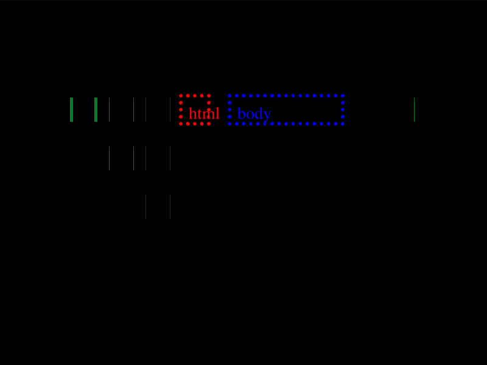

# Daily Target — Jul 27, 2026

Challenge: <https://cssbattle.dev/play/9tg5HEQqGWBN3Apa88HN>

## Result

<table>
	<tr>
		<th width="50%">User Submission</th>
		<th width="50%">Target</th>
	</tr>
	<tr>
		<td width="50%" align="center">
			
		</td>
		<td width="50%" align="center">
			
		</td>
	</tr>
</table>

## Code

```html
<style>*{color:22D16A;margin:80 230 50%150;*{margin:0-110 0 40;--s:64q 0,5ch 5ch,5vw 5pc}box-shadow:inset 1in 0,0 5ch,0 5pc,0 30vw,var(--s,-32q 0,-64q 0,-5lh 0,-32q 5ch,-64q 5ch,-32q 5pc,0 0 0 9in#3450ae
```

## Prettified code

```html
<style>
* {
  color: 22D16A;
  margin: 80 230 50% 150;
  * {
    margin: 0 -110 0 40;
    --s: 64Q 0, 5ch 5ch, 5vw 5pc;
  }
  box-shadow:
    inset 1in 0,
    0 5ch,
    0 5pc,
    0 30vw,
    var(
      --s,
      -32Q 0,
      -64Q 0,
      -5lh 0,
      -32Q 5ch,
      -64Q 5ch,
      -32Q 5pc,
      0 0 0 9in #3450ae
    );
}

</style>
```
