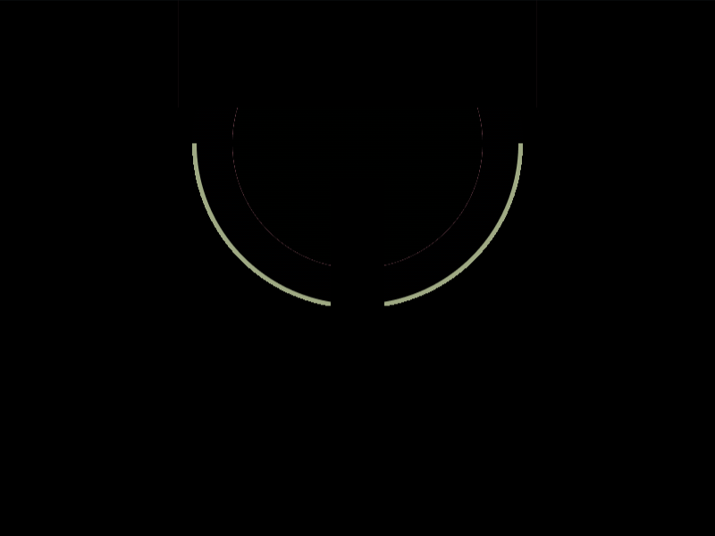

# Daily Target — Jul 28, 2026

Challenge: <https://cssbattle.dev/play/LtfUvFd3HF61ZOGlL9Q9>

## Result

<table>
	<tr>
		<th width="50%">User Submission</th>
		<th width="50%">Target</th>
	</tr>
	<tr>
		<td width="50%" align="center">
			
		</td>
		<td width="50%" align="center">
			
		</td>
	</tr>
</table>

## Code

```html
<p><style>&{margin:-20 80 220;background:#4C4C6B;border:5vw solid#EBF6F0;*{margin:-20-50-120;background:radial-gradient(1q,#4A9A86 74q,#EBF6F0 0 5lh,#0000);p{background:#4A9A86;position:fixed;margin:120 135 0;padding:100 15;box-shadow:0-344q 0 90q#4A9A86
```

## Prettified code

```html
<p>
<style>
& {
  margin: -20 80 220;
  background: #4c4c6b;
  border: 5vw solid #ebf6f0;
  * {
    margin: -20 -50 -120;
    background: radial-gradient(1Q, #4a9a86 74Q, #ebf6f0 0 5lh, transparent);
    p {
      background: #4a9a86;
      position: fixed;
      margin: 120 135 0;
      padding: 100 15;
      box-shadow: 0 -344Q 0 90Q #4a9a86;
    }
  }
}
</style>
```
