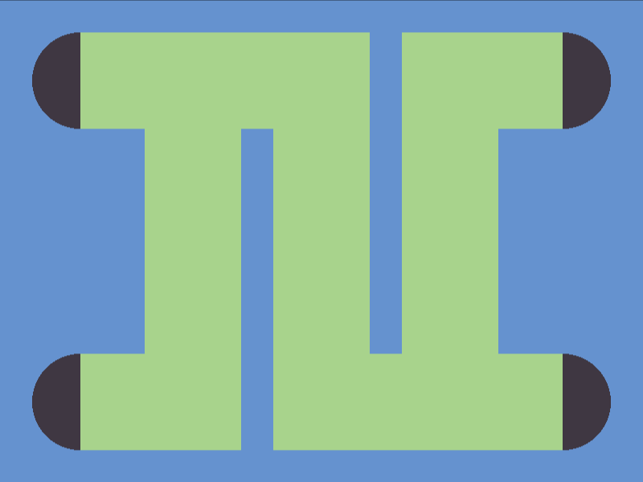

# Daily Target — Jul 31, 2026

Challenge: <https://cssbattle.dev/play/Fyddj98G3Aus7byaOz8c>

## Result

<table>
	<tr>
		<th width="50%">User Submission</th>
		<th width="50%">Target</th>
	</tr>
	<tr>
		<td width="50%" align="center">
			
		</td>
		<td width="50%" align="center">
			
		</td>
	</tr>
</table>

## Code

```html
<p><p><p>
<style>
&{
  background:#6592CF;
  *{
    --s: -70px/40px 200px repeat-y;
    background:
      radial-gradient(1q at 0%, #3F3642 30px, #0000 ) 342px var(--s),
      radial-gradient(1q at 100%, #3F3642 30px, #0000 ) 2px var(--s);
    
  }
 p{
   margin:20 42;
   height:260;
   width:300;
   background:#A8D38B;
   border-radius: 0 var(--f,120px)/ 0 200px;
corner-shape: notch;
   +p{
     --f: 40px;
     scale:1-1;
     
     width:140;
     margin:-280 42;
     +p{
       margin:20 202
     }
   }
 }
 }
```

## Prettified code

```html
<p><p><p>
<style>
&{
  background:#6592CF;
  *{
    --s: -70px/40px 200px repeat-y;
    background:
      radial-gradient(1q at 0%, #3F3642 30px, #0000 ) 342px var(--s),
      radial-gradient(1q at 100%, #3F3642 30px, #0000 ) 2px var(--s);
    
  }
 p{
   margin:20 42;
   height:260;
   width:300;
   background:#A8D38B;
   border-radius: 0 var(--f,120px)/ 0 200px;
corner-shape: notch;
   +p{
     --f: 40px;
     scale:1-1;
     
     width:140;
     margin:-280 42;
     +p{
       margin:20 202
     }
   }
 }
 }
```
