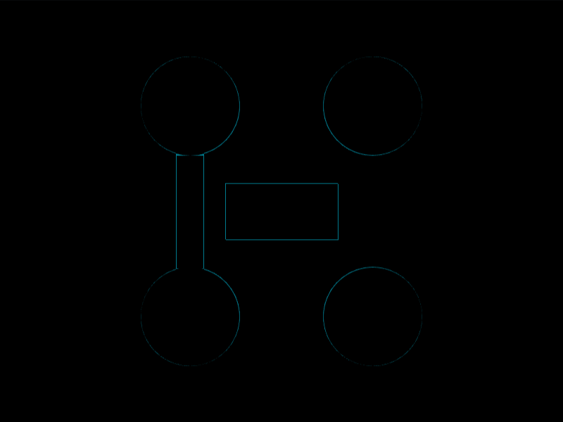

# Daily Target — Aug 2, 2026

Challenge: <https://cssbattle.dev/play/j5lNXe0bnIf95N6TxmQ7>

## Result

<table>
	<tr>
		<th width="50%">User Submission</th>
		<th width="50%">Target</th>
	</tr>
	<tr>
		<td width="50%" align="center">
			
		</td>
		<td width="50%" align="center">
			
		</td>
	</tr>
</table>

## Code

```html
<style>&{background:#e05947;margin:40 100;border:75Q dotted#EED9D9;*{margin:0 85-1-45;background:#eed9d9;*{margin:20 35;padding:20 40
```

## Prettified code

```html

<style>
& {
  background: #e05947;
  margin: 40 100;
  border: 75Q dotted #eed9d9;
  * {
    margin: 0 85 -1 -45;
    background: #eed9d9;
    * {
      margin: 20 35;
      padding: 20 40;
    }
  }
}
</style>
```
