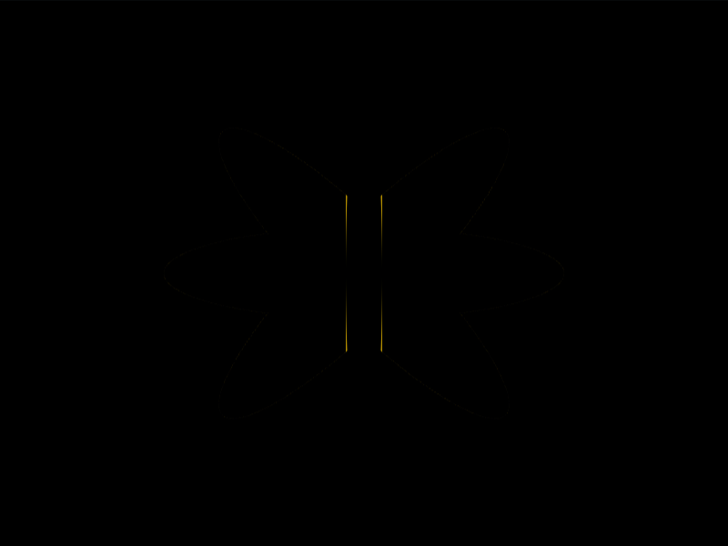

# Daily Target — Aug 3, 2026

Challenge: <https://cssbattle.dev/play/K5tl2pHRpNXPbByrJmVW>

## Result

<table>
	<tr>
		<th width="50%">User Submission</th>
		<th width="50%">Target</th>
	</tr>
	<tr>
		<td width="50%" align="center">
			
		</td>
		<td width="50%" align="center">
			
		</td>
	</tr>
</table>

## Code

```html
<p r=90><p r=45><h5 r=-45>
<style>
&{
  background:#F7EC7D;
  *{
    position:fixed;
    inset: 0;
    margin:auto;
    width:50;
    height:220;
    background:#415E88;
    border-radius:50%;
    rotate:attr(r deg,45deg);
    
  } 
  h5{
    background:#F7EC7D;
    width:20
  }
 }
```

## Prettified code

```html
<p r=90><p r=45><h5 r=-45>
<style>
&{
  background:#F7EC7D;
  *{
    position:fixed;
    inset: 0;
    margin:auto;
    width:50;
    height:220;
    background:#415E88;
    border-radius:50%;
    rotate:attr(r deg,45deg);
    
  } 
  h5{
    background:#F7EC7D;
    width:20
  }
 }
```
