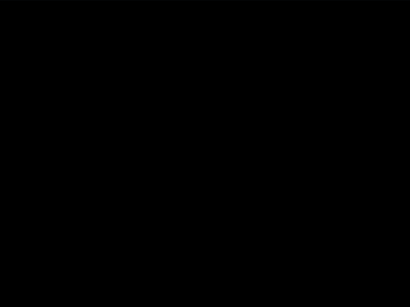

# Daily Target — Aug 6, 2026

Challenge: <https://cssbattle.dev/play/pSfUqdmXCS6D0TBIPxii>

## Result

<table>
	<tr>
		<th width="50%">User Submission</th>
		<th width="50%">Target</th>
	</tr>
	<tr>
		<td width="50%" align="center">
			
		</td>
		<td width="50%" align="center">
			
		</td>
	</tr>
</table>

## Code

```html
<style>&{background:#0E127D;*{margin:80 60;background:linear-gradient(#0E127D 6vw,#0000 0)0 10px/35vw 1in repeat-y,linear-gradient(90deg,#0E127D 6vw,#EDDF5A 0 1in,#0E127D 0 30vw,#EDDF5A 0)50vh
```

## Prettified code

```html
<style>
& {
  background: #0e127d;
  * {
    margin: 80 60;
    background:
      linear-gradient(#0e127d 6vw, transparent 0) 0 10px / 35vw 1in repeat-y,
      linear-gradient(
          90deg,
          #0e127d 6vw,
          #eddf5a 0 1in,
          #0e127d 0 30vw,
          #eddf5a 0
        )
        50vh;
  }
}

</style>
```
