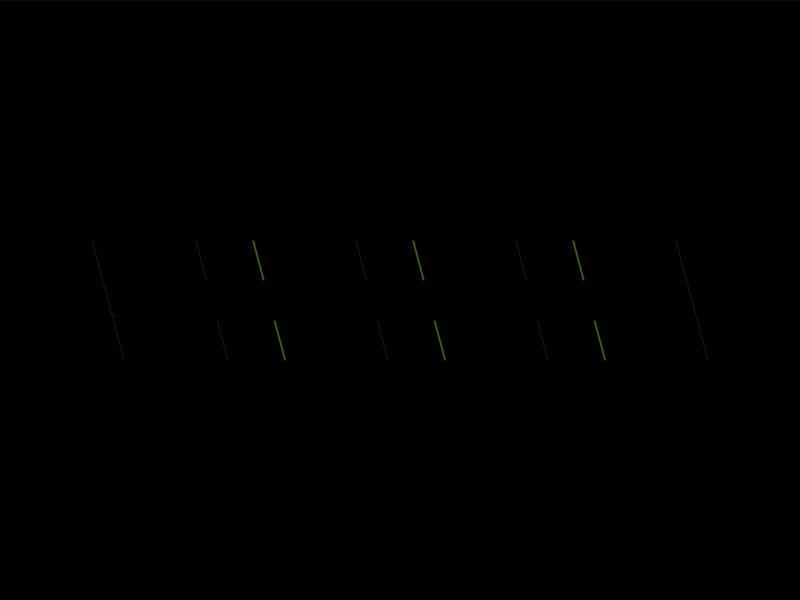

# Daily Target — Aug 7, 2026

Challenge: <https://cssbattle.dev/play/jXxptfsRY42J9Y775Pc6>

## Result

<table>
	<tr>
		<th width="50%">User Submission</th>
		<th width="50%">Target</th>
	</tr>
	<tr>
		<td width="50%" align="center">
			
		</td>
		<td width="50%" align="center">
			
		</td>
	</tr>
</table>

## Code

```html
<p><style>&{background:#a82973;>*{margin:30%54;background:#ea9a52;transform:skew(15deg);*{margin:0 90%0 0;height:20;color:A82973;box-shadow:52px 0,33vw 0,53vw 0,52px 5ch,33vw 5ch,53vw 5ch
```

## Prettified code

```html
<p>
<style>
& {
  background: #a82973;
  > * {
    margin: 30% 54;
    background: #ea9a52;
    transform: skew(15deg);
    * {
      margin: 0 90% 0 0;
      height: 20;
      color: A82973;
      box-shadow:
        52px 0,
        33vw 0,
        53vw 0,
        52px 5ch,
        33vw 5ch,
        53vw 5ch;
    }
  }
}
</style>
```
