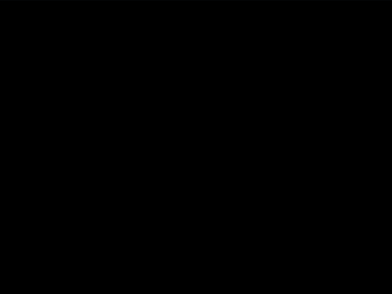

# Daily Target — Aug 8, 2026

Challenge: <https://cssbattle.dev/play/QzsqG049RL4V9DItHXt7>

## Result

<table>
	<tr>
		<th width="50%">User Submission</th>
		<th width="50%">Target</th>
	</tr>
	<tr>
		<td width="50%" align="center">
			
		</td>
		<td width="50%" align="center">
			
		</td>
	</tr>
</table>

## Code

```html
<style>*{background:#2e8da6;margin:5%86%60%0;color:FFF1F1;box-shadow:60px 0,43vw 0,71vw 0,29vw 5ch#E5969E,57vw 5ch#E5969E;*{margin:0;translate:0 45vw
```

## Prettified code

```html
<style>
* {
  background: #2e8da6;
  margin: 5% 86% 60% 0;
  color: FFF1F1;
  box-shadow:
    60px 0,
    43vw 0,
    71vw 0,
    29vw 5ch #e5969e,
    57vw 5ch #e5969e;
  * {
    margin: 0;
    translate: 0 45vw;
  }
}

</style>
```
