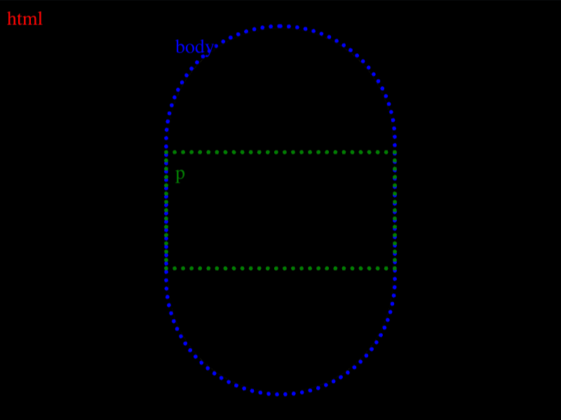

# Daily Target — Aug 11, 2026

Challenge: <https://cssbattle.dev/play/9PFKqCOsKmSizurb6gRt>

## Result

<table>
	<tr>
		<th width="50%">User Submission</th>
		<th width="50%">Target</th>
	</tr>
	<tr>
		<td width="50%" align="center">
			
		</td>
		<td width="50%" align="center">
			
		</td>
	</tr>
</table>

## Code

```html
<p><style>&{background:#3a2568;>*{border-radius:9in;margin:5%120;border-radius:9in;border-block:5pc solid#f9ddc6;*{margin:10 0;height:80;border-inline:double 64q#9D92C8
```

## Prettified code

```html
<p>
<style>
& {
  background: #3a2568;
  > * {
    border-radius: 9in;
    margin: 5% 120;
    border-radius: 9in;
    border-block: 5pc solid #f9ddc6;
    * {
      margin: 10 0;
      height: 80;
      border-inline: double 64Q #9d92c8;
    }
  }
}
</style>
```
