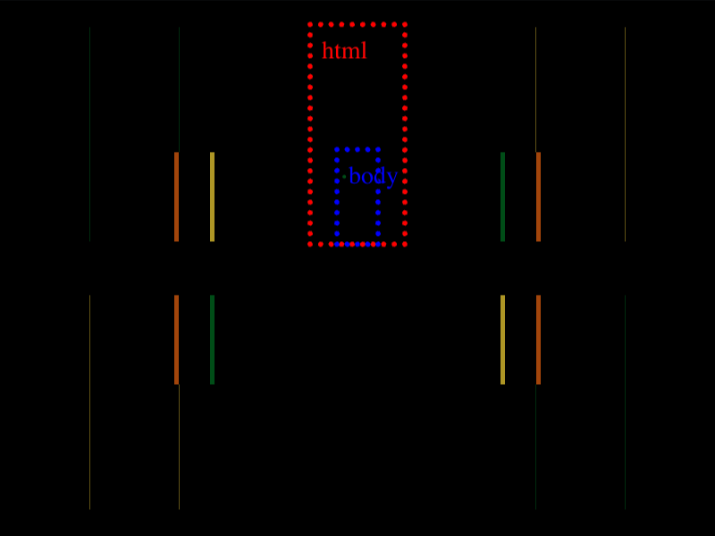

# Daily Target — Aug 13, 2026

Challenge: <https://cssbattle.dev/play/03BN1qoufCW2Lj4bz6Em>

## Result

<table>
	<tr>
		<th width="50%">User Submission</th>
		<th width="50%">Target</th>
	</tr>
	<tr>
		<td width="50%" align="center">
			
		</td>
		<td width="50%" align="center">
			
		</td>
	</tr>
</table>

## Code

```html
.<style>&{background:#4C4C6B;margin:15 175 165;color:#4A9A86;box-shadow:-132q 0,132q 0#FAE29E,-132q 50vh#FAE29E,132q 50vh;*{margin:70 15 0;box-shadow:-5lh 0#FAE29E,5lh 0,-5lh 5pc,5lh 5pc#FAE29E
```

## Prettified code

```html
.
<style>
& {
  background: #4c4c6b;
  margin: 15 175 165;
  color: #4a9a86;
  box-shadow:
    -132Q 0,
    132Q 0 #fae29e,
    -132Q 50vh #fae29e,
    132Q 50vh;
  * {
    margin: 70 15 0;
    box-shadow:
      -5lh 0 #fae29e,
      5lh 0,
      -5lh 5pc,
      5lh 5pc #fae29e;
  }
}
</style>
```
