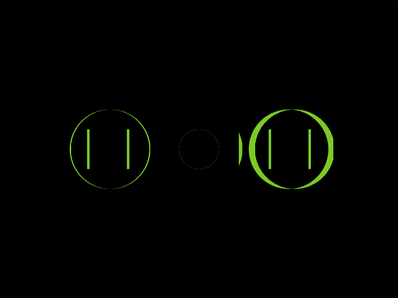

# Daily Target — Aug 14, 2026

Challenge: <https://cssbattle.dev/play/tX0iC11qNcPozRZ9qhRO>

## Result

<table>
	<tr>
		<th width="50%">User Submission</th>
		<th width="50%">Target</th>
	</tr>
	<tr>
		<td width="50%" align="center">
			
		</td>
		<td width="50%" align="center">
			
		</td>
	</tr>
</table>

## Code

```html
<style>&{box-shadow:0 0 0 9in#6D1477;margin:0 65;background:radial-gradient(1q,#F5E3B5 5ch,#6D1477)0/5lh;*{margin:110 95;background:radial-gradient(1q,#6D1477 5vw,#F5E3B5);color:6D1477;box-shadow:-5lh 0 0-5vw,5lh 0 0-5vw
```

## Prettified code

```html
<style>
& {
  box-shadow: 0 0 0 9in #6d1477;
  margin: 0 65;
  background: radial-gradient(1Q, #f5e3b5 5ch, #6d1477) 0 / 5lh;
  * {
    margin: 110 95;
    background: radial-gradient(1Q, #6d1477 5vw, #f5e3b5);
    color: 6D1477;
    box-shadow:
      -5lh 0 0 -5vw,
      5lh 0 0 -5vw;
  }
}

</style>
```
