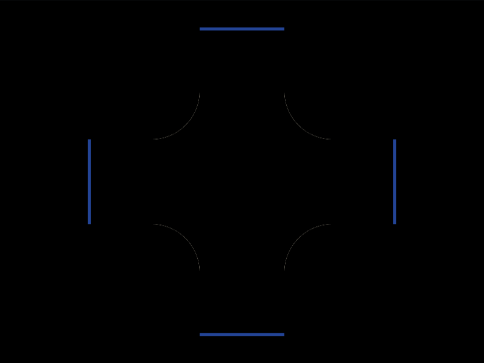

# Daily Target — Aug 15, 2026

Challenge: <https://cssbattle.dev/play/qdiV2eKiBihdqV4XlG9i>

## Result

<table>
	<tr>
		<th width="50%">User Submission</th>
		<th width="50%">Target</th>
	</tr>
	<tr>
		<td width="50%" align="center">
			
		</td>
		<td width="50%" align="center">
			
		</td>
	</tr>
</table>

## Code

```html
<style>&{background:#fff;*{border:10px solid#FFF;margin:65 115;background:radial-gradient(1q,#FFF 5ch,#394257)75px 75px;color:D9BB61;box-shadow:-5lh 0 0-50px,5lh 0 0-50px,0 5lh 0-50px,0-5lh 0-50px
```

## Prettified code

```html
<style>
& {
  background: #fff;
  * {
    border: 10px solid #fff;
    margin: 65 115;
    background: radial-gradient(1Q, #fff 5ch, #394257) 75px 75px;
    color: D9BB61;
    box-shadow:
      -5lh 0 0 -50px,
      5lh 0 0 -50px,
      0 5lh 0 -50px,
      0 -5lh 0 -50px;
  }
}

</style>
```
