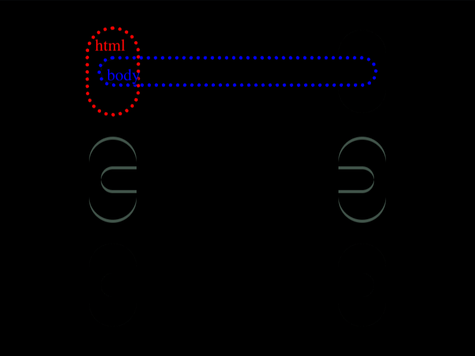

# Daily Target — Aug 16, 2026

Challenge: <https://cssbattle.dev/play/SSYv7g49QSFpWX8VVeXf>

## Result

<table>
	<tr>
		<th width="50%">User Submission</th>
		<th width="50%">Target</th>
	</tr>
	<tr>
		<td width="50%" align="center">
			
		</td>
		<td width="50%" align="center">
			
		</td>
	</tr>
</table>

## Code

```html
<style>*{background:#6592CF;border-radius:9in;margin:25 285 205 75;color:243D83;box-shadow:inset 1in 0,var(--s,70vh 0,70vh 5lh,70vh 45vw,)0 5lh,0 45vw;*{--s:;color:6592CF;margin:25-200 25 10
```

## Prettified code

```html
<style>
* {
  background: #6592cf;
  border-radius: 9in;
  margin: 25 285 205 75;
  color: 243D83;
  box-shadow:
    inset 1in 0,
    var(--s, 70vh 0, 70vh 5lh, 70vh 45vw,) 0 5lh,
    0 45vw;
  * {
    --s:;
    color: 6592CF;
    margin: 25 -200 25 10;
  }
}

</style>
```
