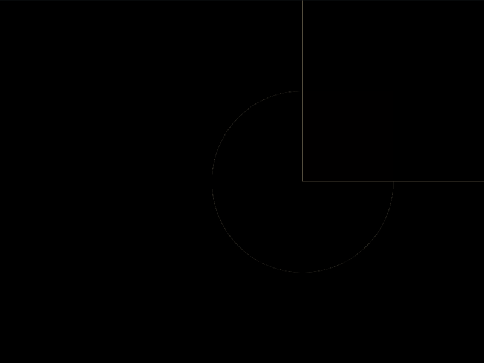

# Daily Target — Aug 17, 2026

Challenge: <https://cssbattle.dev/play/H7DBc8YLyOFJFNJ78t9U>

## Result

<table>
	<tr>
		<th width="50%">User Submission</th>
		<th width="50%">Target</th>
	</tr>
	<tr>
		<td width="50%" align="center">
			
		</td>
		<td width="50%" align="center">
			
		</td>
	</tr>
</table>

## Code

```html
<style>&{background:radial-gradient(1Q,#7c7565 75px,#f1e1be)53Q;*{margin:0 0 225 325;color:7c7565;box-shadow:-79q 0,0 79q,-79q 79q#F1E1BE
```

## Prettified code

```html
<style>
& {
  background: radial-gradient(1Q, #7c7565 75px, #f1e1be) 53Q;
  * {
    margin: 0 0 225 325;
    color: 7c7565;
    box-shadow:
      -79Q 0,
      0 79Q,
      -79Q 79Q #f1e1be;
  }
}

</style>
```
