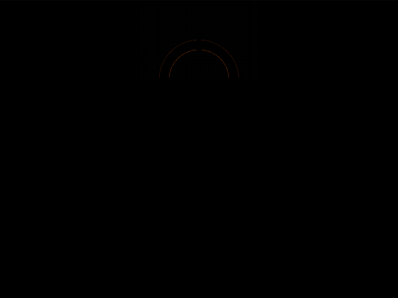

# Daily Target — Aug 19, 2026

Challenge: <https://cssbattle.dev/play/7qCzNi5UMQyeBSqmMCFG>

## Result

<table>
	<tr>
		<th width="50%">User Submission</th>
		<th width="50%">Target</th>
	</tr>
	<tr>
		<td width="50%" align="center">
			
		</td>
		<td width="50%" align="center">
			
		</td>
	</tr>
</table>

## Code

```html
<style>*{border-inline:45px solid#E38F66}&{background:radial-gradient(1q at bottom,#284A5B 32q,#E38F66 0 5ch,#284A5B 0)0-45vw#284A5B space;margin:100 95 40;*{margin:-20-15 0
```

## Prettified code

```html
<style>
* {
  border-inline: 45px solid #e38f66;
}
& {
  background: radial-gradient(
      1Q at bottom,
      #284a5b 32Q,
      #e38f66 0 5ch,
      #284a5b 0
    )
    0 -45vw #284a5b space;
  margin: 100 95 40;
  * {
    margin: -20 -15 0;
  }
}

</style>
```
