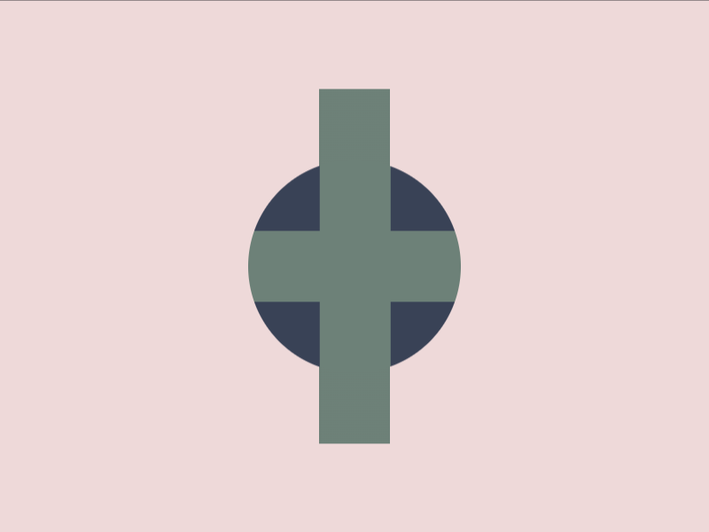

# Daily Target — Aug 20, 2026

Challenge: <https://cssbattle.dev/play/7lcu3rTkviI1UxocQlAN>

## Result

<table>
	<tr>
		<th width="50%">User Submission</th>
		<th width="50%">Target</th>
	</tr>
	<tr>
		<td width="50%" align="center">
			
		</td>
		<td width="50%" align="center">
			
		</td>
	</tr>
</table>

## Code

```html
<style>*{background:conic-gradient(var(--b,#0000 75%),#6D8178 0)var(--p,45vw 53q/5pc 25pc no-repeat#EED9D9);*{--b:#394257 25%;--p:11q 0/5pc 5pc;margin:90;clip-path:circle(
```

## Prettified code

```html
<style>
* {
  background: conic-gradient(var(--b, transparent 75%), #6d8178 0)
    var(--p, 45vw 53Q / 5pc 25pc no-repeat #eed9d9);
  * {
    --b: #394257 25%;
    --p: 11Q 0 / 5pc 5pc;
    margin: 90;
    clip-path: circle();
  }
}

</style>
```
