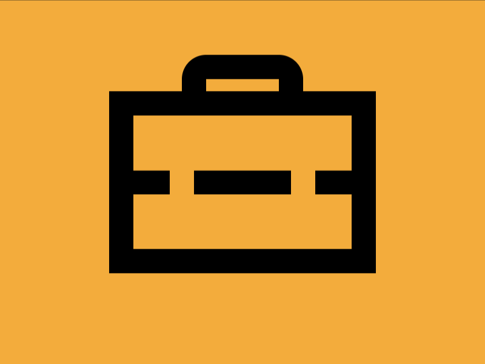

# Daily Target — Aug 23, 2026

Challenge: <https://cssbattle.dev/play/JnFr5t4kizJ7EFZtXnVL>

## Result

<table>
	<tr>
		<th width="50%">User Submission</th>
		<th width="50%">Target</th>
	</tr>
	<tr>
		<td width="50%" align="center">
			
		</td>
		<td width="50%" align="center">
			
		</td>
	</tr>
</table>

## Code

```html
<p><style>*{border:5vw solid;background:#f3ac3c;margin:75 90;>*{height:10;margin:-50 40;border-radius:var(--r,5vw);*{--r:;margin:65-40;border:dashed;border-width:0 0 20;scale:2 1;clip-path:inset(11q 5vw 0
```

## Prettified code

```html
<p>
<style>
* {
  border: 5vw solid;
  background: #f3ac3c;
  margin: 75 90;
  > * {
    height: 10;
    margin: -50 40;
    border-radius: var(--r, 5vw);
    * {
      --r:;
      margin: 65 -40;
      border: dashed;
      border-width: 0 0 20;
      scale: 2 1;
      clip-path: inset(11Q 5vw 0);
    }
  }
}
</style>
```
