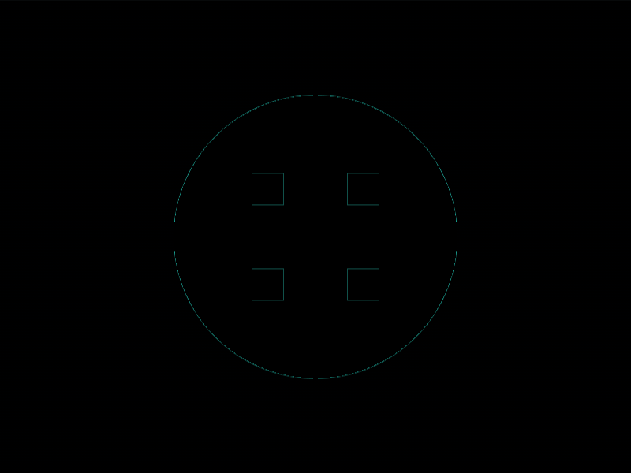
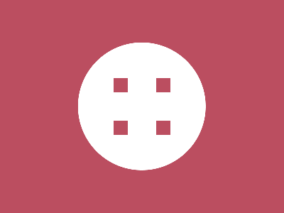

# Daily Target — Aug 24, 2026

Challenge: <https://cssbattle.dev/play/CBG1TILZdQr1NiLspgv1>

## Result

<table>
	<tr>
		<th width="50%">User Submission</th>
		<th width="50%">Target</th>
	</tr>
	<tr>
		<td width="50%" align="center">
			
		</td>
		<td width="50%" align="center">
			
		</td>
	</tr>
</table>

## Code

```html
<style>&{background:radial-gradient(1q,#fff 95q,#BB4E60);*{margin:35%190;color:BB4E60;box-shadow:-32q -32q,32q 32q,32q -32q,-32q 32q
```

## Prettified code

```html
<style>
& {
  background: radial-gradient(1Q, #fff 95Q, #bb4e60);
  * {
    margin: 35% 190;
    color: BB4E60;
    box-shadow:
      -32Q -32Q,
      32Q 32Q,
      32Q -32Q,
      -32Q 32Q;
  }
}

</style>
```
