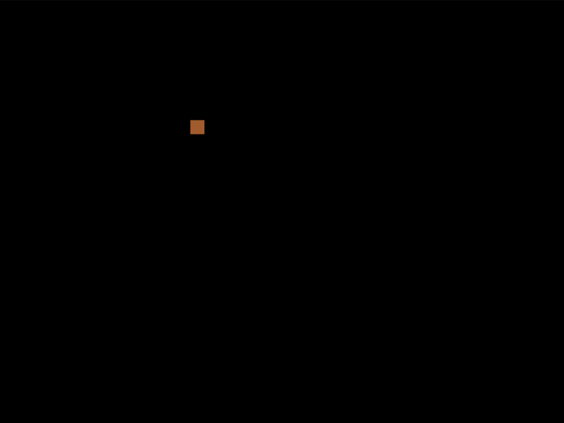

# Daily Target — Aug 25, 2026

Challenge: <https://cssbattle.dev/play/G73oyNUHfqrOK7aQqOZR>

## Result

<table>
	<tr>
		<th width="50%">User Submission</th>
		<th width="50%">Target</th>
	</tr>
	<tr>
		<td width="50%" align="center">
			
		</td>
		<td width="50%" align="center">
			
		</td>
	</tr>
</table>

## Code

```html
<style>&{background:conic-gradient(at 70vw 70vw,#3e6d43 75%,#0000 0)63q 11q,conic-gradient(at 196q 45vh,#E5CA72 75%,#3E6D43 0)0 0/215px 55vh;*{color:#E5CA72;margin:95 145;height:50;border:32q solid;box-shadow:-79q -79q 0-5px,79q -79q 0-5px,-79q 79q 0-5px,79q 79q 0-5px
```

## Prettified code

```html
<style>
& {
  background:
    conic-gradient(at 70vw 70vw, #3e6d43 75%, transparent 0) 63Q 11Q,
    conic-gradient(at 196Q 45vh, #e5ca72 75%, #3e6d43 0) 0 0 / 215px 55vh;
  * {
    color: #e5ca72;
    margin: 95 145;
    height: 50;
    border: 32Q solid;
    box-shadow:
      -79Q -79Q 0 -5px,
      79Q -79Q 0 -5px,
      -79Q 79Q 0 -5px,
      79Q 79Q 0 -5px;
  }
}

</style>
```
