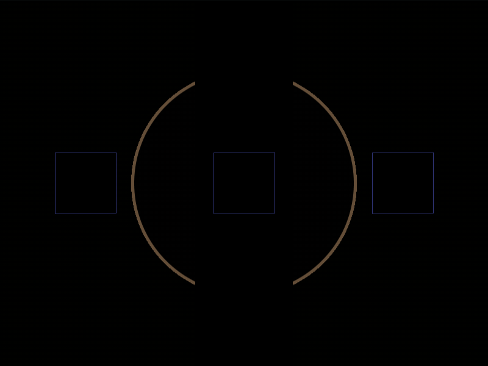

# Daily Target — Aug 26, 2026

Challenge: <https://cssbattle.dev/play/73FtfyFQ7BgJHeS18cU0>

## Result

<table>
	<tr>
		<th width="50%">User Submission</th>
		<th width="50%">Target</th>
	</tr>
	<tr>
		<td width="50%" align="center">
			
		</td>
		<td width="50%" align="center">
			
		</td>
	</tr>
</table>

## Code

```html
<style>&{background:conic-gradient(at 53q 53q,#0000 75%,#FFF 0)48q 132q/130px,linear-gradient(90deg,#BBB54E 5pc,#0000 0)40vw,radial-gradient(1q,#566713 5lh,#bbb54e
```

## Prettified code

```html
<style>
& {
  background:
    conic-gradient(at 53Q 53Q, transparent 75%, #fff 0) 48Q 132Q / 130px,
    linear-gradient(90deg, #bbb54e 5pc, transparent 0) 40vw,
    radial-gradient(1Q, #566713 5lh, #bbb54e);
}

</style>
```
